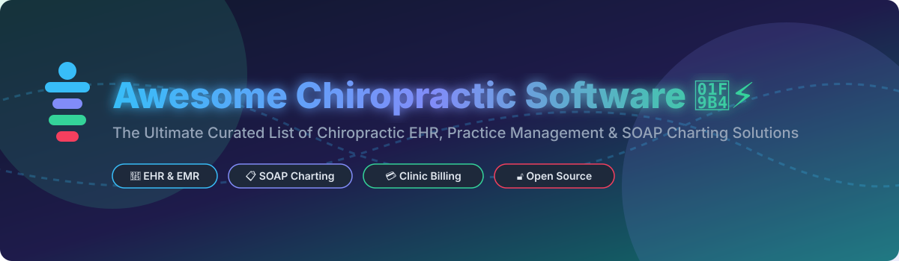

# 🦴 Awesome Chiropractic Software ⚡

  
  
  
  
  

## 🚀 Top Chiropractic Software Ecosystem

**Curated List of Chiropractic EHR, Practice Management SaaS Platforms & Open-Source Projects** 🏥

*Focused on Chiropractic EHR, Practice Management Systems, SOAP Charting, Billing & Patient Engagement* 📑

**Last updated: September 2026** 📅

---

### 🔍 Overview & SEO Keywords
This repository tracks top **Chiropractic Software SaaS platforms**, **Electronic Health Record (EHR) systems**, and **open-source healthcare software projects**. These solutions help chiropractors, clinic managers, and physical therapy practices streamline patient intake, automate SOAP note charting, handle medical billing & claims scrubbing, and optimize scheduling.

---

## 📌 Table of Contents
- [📊 Market Overview](#-market-overview)
- [💻 SaaS & Commercial Platforms](#-saas--commercial-platforms)
- [🔓 Open-Source GitHub Projects](#-open-source-github-projects)
- [🤝 How to Contribute](#-how-to-contribute)
- [⚠️ Disclaimer](#%EF%B8%8F-disclaimer)
- [💖 Support & Sponsorship](#-support--sponsorship)
- [📈 Star History](#-star-history)

---

## 📊 Market Overview

> 💡 **Market Size & Structure**: The global Chiropractic Software market is valued at approximately **$286M - $1.1B** (2024–2026) and is projected to reach **$1.7B by 2032** growing at a CAGR of **8.3%**. The sector is **moderately fragmented**, undergoing rapid consolidation where established practice management providers are acquiring billing services and specialty EHR tools to create unified ecosystems.

---

## 💻 SaaS & Commercial Platforms

| Company / Product | Size (Revenue / Valuation) 🏢 | Starting Price 💵 | Free Tier / Trial Limits 🎁 | Key Features & Highlights 🌟 |
| :--- | :--- | :--- | :--- | :--- |
| **[Jane App](https://jane.app/)** | **~$100M+ ARR** / ~$1.8B Valuation | $54/month (+ $35/mo per full-time provider) | ❌ No free tier (Free 1-on-1 demo & trial migration assistance) | AI Scribe for draft chart notes, peer-built charting templates, online intake forms, integrated payments & multi-discipline support. |
| **[Office Ally (Practice Mate)](https://www.officeally.com/)** | **~$26M - $45M ARR** (Francisco Partners) | $39.95/month (Base Practice Mate) | ❌ No free tier (Free clearinghouse options for specific payer mixes; paid practice mate) | Revenue cycle management, claims scrubbing, ERA auto-posting, patient scheduling, and HIPAA-compliant portal. |
| **[ChiroTouch](https://www.chirotouch.com/)** | **~$14M - $43M ARR** (PracticeTek) | $139/month (Core / Start plan) | ❌ No free tier (Guided interactive demo available) | Trusted by 12,500+ practices. Rheo AI Scribe (saves 92% charting time), CT Pay embedded billing, natural language scheduling. |
| **[Cliniko](https://www.cliniko.com/)** | **~$1.5M - $4.6M ARR** (Self-Funded) | $45/month (1 Practitioner) | 🎁 **30-Day Free Trial** (Full access, no credit card required) | Streamlined booking, customizable clinical SOAP notes, integrated billing, automated SMS/email reminders. |
| **[Genesis Chiropractic Software](https://genesischiropracticsoftware.com/)** | **~$5M - $10M ARR** (ClinicMind) | $97/month (Cash Plan) | ❌ No free tier (Custom live software demo) | Cloud-based ONC-certified EHR, travel cards, X-ray tracking, automated billing workflows, and outcome measurement. |
| **[ClinicMind](https://www.clinicmind.com/chiropractic)** | **~$5M - $15M ARR** | $150/month (Estimated base tier) | ❌ No free tier (Free consultation & live demo) | AI SOAP notes learning provider style, multi-location central visibility, full-service credentialing (billing in 3-6 weeks). |
| **[EZBIS](https://ezbis.com/)** | **~$3M - $8M ARR** | $225/month (Modular base) | ❌ No free tier (Free remote demo session) | Established in 1980. Highly customizable macros, ICD-10 body charts, patient self-check-in kiosks, and dictation support. |
| **[Platinum System](https://www.platinumsystem.com/)** | **~$2M - $6M ARR** | $120/month | ❌ No free tier (Free personalized demo) | Speed-focused EHR with health card check-in, automated arrival lists, one-screen patient view, and fast macro SOAP notes. |
| **[InTouch EMR](https://intouchemr.com/)** | **~$1M - $5M ARR** | $149/month | ❌ No free tier (Free live demo) | Real-time eligibility verification, iPad clinical app, automated outcome tracking, customizable templates, ONC certified. |
| **[PracticeHub](https://www.practicehub.io/)** | **~$1M - $3M ARR** | $99/month | 🎁 **30-Day Free Trial** (Startup scheme with up to 90% off for new practices) | All-in-one platform covering scheduling, clinical notes, memberships, patient mobile app, and 40+ integrations. |

---

## 🔓 Open-Source GitHub Projects

> 📢 **Open-Source Landscape**: While chiropractic software is commercially dominated, the open-source ecosystem offers general-purpose EHRs, AI clinical decision engines, and local-first patient journals that can be customized for chiropractic workflows.

| Project Name | Stars ⭐ | License 📜 | Stack / Architecture 🛠️ | Description & Use Case 📝 |
| :--- | :---: | :---: | :--- | :--- |
| **[OpenEMR](https://github.com/openemr/openemr)** |  | GPL-3.0 | PHP, MySQL, JavaScript | Most popular ONC-certified open-source EHR & practice management system. Features scheduling, billing, and customizable SOAP forms. |
| **[Hospital Management EMR](https://github.com/opensource-emr/hospital-management-emr)** |  | MIT | Angular, ASP.NET Core, C# | Modern, scalable EMR platform with patient records, clinic management, appointment booking, and billing modules. |
| **[Open Hospital](https://github.com/informatici/openhospital)** |  | GPL-3.0 | Java, MySQL | Free Health Information System (HIMS) designed for offline, standalone, or small network clinic operations. |
| **[EHRbase](https://github.com/ehrbase/ehrbase)** |  | Apache-2.0 | Java, Spring Boot, openEHR | Standard-compliant openEHR clinical data repository backend for constructing custom chiropractic EHR & SOAP note solutions. |
| **[OpenClinic (jact)](https://github.com/jact/openclinic)** |  | GPL-2.0 | PHP, MySQL | Lightweight open-source medical record system for patient administration, medical history, problem reports, and clinic logs. |
| **[ChiroCard](https://github.com/ehukaimedia/chirocard)** |  | MIT | React 19, TS, Vite, Dexie.js | **Local-first patient bodywork journal & passport PWA**. All records remain on patient device; features interactive body map for SOAP logging. |
| **[Imhotep Smart Clinic](https://github.com/Imhotep-Tech/imhotep_smart_clinic)** |  | MIT | Django 4.2+, TailwindCSS | Modern clinic management system with digital records, smart scheduling, prescription tracking, and PDF reports. |
| **[OpenClinic AI](https://github.com/llamasearchai/OpenClinic)** |  | MIT | Python, FastAPI, Next.js | Healthcare AI clinical decision support platform using OpenAI agents for symptom analysis, NLP summarization, and FHIR integration. |

---

## 🤝 How to Contribute

1. Fork this repository 🍴
2. Create a new feature branch (`git checkout -b add-new-software`)
3. Add or update entries in `README.md` maintaining table formatting
4. Submit a Pull Request with details 🚀

---

## ⚠️ Disclaimer

- This repository is a **community-curated list** for informational and educational purposes.
- Chiropractic software handles sensitive Protected Health Information (PHI); ensure full compliance with **HIPAA**, **GDPR**, and applicable healthcare regulations before deployment.

---

## 💖 Support & Sponsorship

If you find this repository helpful for your practice, research, or clinical development, please consider showing your support:

- ⭐ **Star this repository** to help others discover it!
- 🍴 **Fork it** to contribute new tools and updates.
- 📢 **Share it** with fellow chiropractors, developers, and clinic managers.
- ☕ **Buy me a coffee / Sponsor**: Support ongoing maintenance via the [GitHub Sponsor Dashboard](https://github.com/sponsors/ishandutta2007).

*Thank you for supporting open healthcare software development!* 🙏

---

## 📈 Star History

